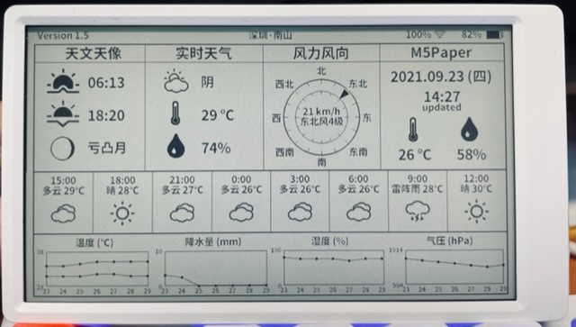

## M5PaperWeather
  *** M5Paper project with weather information from 和风天气（qweather）***

   

### Description
  Arduino project to show internal environment data and weather information from 
  qweather https://dev.qweather.com/ on the e-ink display of the M5Paper.
  使用前，请编辑`Config.Simple.h`中的WIFI配置、和风天气的API配置等信息，并重命名为`Config.h`
  可以展示如下信息
  * 顶栏 展示版本、所配置地区、wifi强度、电池电量
  * 天文天相 展示日出日落时间、月相信息
  * 实时天气 展示所配置地区当前天气状况、温度、湿度信息（API获取）
  * 风力风向 展示所配置地区当前风速、风力等级、风向信息
  * M5Paper区域 展示更新时间、当前气温、湿度（内部传感器）
  * 逐小时预报区域显示24h内的天气信息（间隔3h）
  * 预报区域展示未来7天的温度、降水、湿度、气压预报信息

### Disclaimer
   I don't take any responsibility nor liability for using this software nor for the 
   installation or any tips, advice, videos, etc. given by any member of this site or any related site.

### License
   This program is licensed under GPL-3.0

### Thanks
   * https://www.arduino.cc
     *Thanks to the Arduino community with all its incredible possibilities and support.** 
   * Special thanks for the drawing function of the moon and the wind section from David Bird
     https://github.com/G6EJD/ESP32-Revised-Weather-Display-42-E-Paper
